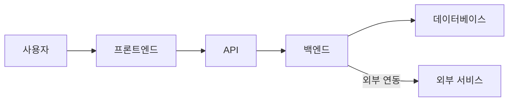

# .serena/memories 상세 가이드

이 문서는 .serena/memories 폴더의 각 파일에 대한 상세한 작성 가이드를 제공합니다.

## 전체 구조

```
/.serena/memories/
├── activeContext.md      # 현재 진행 중인 작업
├── progress.md           # 시간순 진행 기록
├── projectBrief.md       # 프로젝트 개요
├── techContext.md        # 기술 컨텍스트
├── dataflow.md           # 데이터 흐름
└── test_results/         # 테스트 결과 저장소
    ├── YYYY-MM-DD_test-name/
    │   ├── README.md
    │   └── ...
    └── ...
```

## 파일별 상세 가이드

### 1. activeContext.md

**목적**
- 현재 진행 중인 작업의 상태를 실시간으로 추적
- 완료된 작업은 삭제되어야 합니다.

**템플릿**:
```markdown
# 현재 활성 컨텍스트

## 진행 중인 작업: [작업명]

### 기본 정보
- 시작일: YYYY-MM-DD
- 예상 완료일: YYYY-MM-DD (선택사항)
- 담당: [담당자/에이전트]

### 작업 목표
[이 작업을 통해 달성하고자 하는 것]

### 현재 진행 상황
- [x] 완료된 항목 1
- [x] 완료된 항목 2
- [ ] 진행 중인 항목 3
- [ ] 대기 중인 항목 4

### 주요 결정사항
1. [결정 1]: [내용 및 근거]
2. [결정 2]: [내용 및 근거]

### 직면한 문제
- **문제 1**: [문제 설명]
  - 상태: [조사 중/해결 중/해결됨]
  - 해결 방안: [시도한 방법 또는 계획]

### 관련 파일
- [파일 경로 1]: [역할/변경 내용]
- [파일 경로 2]: [역할/변경 내용]

### 참고사항
[작업 중 알아둬야 할 추가 정보]
```

**작성 원칙**:
- 작업 시작 시 생성
- 진행 중 실시간 업데이트
- 작업 완료 코드베이스에 반영된 주요 내용만을 추출하여 간략하게 progress.md에 추가합니다.
- 완료 후 이 파일은 초기화 (다음 작업을 위해)

---

### 2. progress.md

**목적**: 프로젝트의 전체 진행 내역을 시간순으로 기록

**템플릿**:
```markdown
# 프로젝트 진행 상황

## YYYY-MM-DD

### [작업/기능명]
- **완료 내용**: [무엇을 했는지 요약]
- **주요 변경사항**:
  - [변경사항 1]
  - [변경사항 2]
- **영향 범위**: [어떤 부분에 영향을 미치는지]
- **관련 파일**:
  - `경로/파일1.js` - [역할]
  - `경로/파일2.py` - [역할]
- **비고**: [추가 설명이 필요한 경우]

### [다른 작업/기능명]
...

## YYYY-MM-DD (이전 날짜)
...
```

**작성 원칙**:
- **시간 역순 정렬**: 최신 항목이 최상단
- 하루에 여러 작업이 있으면 같은 날짜 아래 그룹화
- activeContext.md의 완료된 작업을 요약하여 추가
- 중요한 마일스톤이나 목표 달성도 기록
- 간결하되 필수 정보는 모두 포함

---

### 3. projectBrief.md

**목적**: 프로젝트의 전체 개요와 목표를 유지

**템플릿**:
```markdown
# 프로젝트 요약 (최종 업데이트: YYYY-MM-DD)

## 개요
[프로젝트가 무엇인지 1-2문단으로 설명]

## 목표
### 주요 목표
1. [목표 1]
2. [목표 2]
3. [목표 3]

### 세부 목표
- [세부 목표 1]
- [세부 목표 2]

## 핵심 기능
### 필수 기능
1. **[기능명]**: [설명]
   - 상태: [계획/진행 중/완료]

2. **[기능명]**: [설명]
   - 상태: [계획/진행 중/완료]

### 추가 기능
- [추가 기능 1] (우선순위: 높음/중간/낮음)
- [추가 기능 2]

## 제약사항
- [제약사항 1]
- [제약사항 2]

## 성공 기준
- [성공 기준 1]
- [성공 기준 2]

## 타임라인
- 시작일: YYYY-MM-DD
- 목표 완료일: YYYY-MM-DD
- 주요 마일스톤:
  - [마일스톤 1]: YYYY-MM-DD
  - [마일스톤 2]: YYYY-MM-DD
```

**작성 원칙**:
- 프로젝트 시작 시 작성
- 목표나 범위 변경 시에만 업데이트
- 최종 업데이트 날짜 명시
- 프로젝트의 "왜"와 "무엇"에 집중

---

### 4. techContext.md

**목적**: 프로젝트의 기술적 결정사항과 컨텍스트 기록

**템플릿**:
```markdown
# 기술 컨텍스트 (최종 업데이트: YYYY-MM-DD)

## 주요 기술 스택

### 백엔드
- **[프레임워크/라이브러리명]**
  - 버전: [버전]
  - 용도: [사용 목적]
  - 선택 이유: [왜 선택했는지]
  - 도입일: YYYY-MM-DD

### 프론트엔드
- **[프레임워크/라이브러리명]**
  - 버전: [버전]
  - 용도: [사용 목적]
  - 선택 이유: [왜 선택했는지]
  - 도입일: YYYY-MM-DD

### 데이터베이스
- **[데이터베이스명]**
  - 버전: [버전]
  - 용도: [사용 목적]
  - 선택 이유: [왜 선택했는지]
  - 도입일: YYYY-MM-DD

### 기타 도구
- **[도구명]**: [용도 및 선택 이유]

## 아키텍처 패턴

### [패턴명] (예: MVC, 마이크로서비스, etc.)
- **도입일**: YYYY-MM-DD
- **적용 범위**: [어디에 적용되는지]
- **선택 이유**: [왜 이 패턴을 선택했는지]
- **구현 상세**:
  - [상세 설명 1]
  - [상세 설명 2]

## 중요한 기술적 결정

### [결정사항 제목]
- **날짜**: YYYY-MM-DD
- **결정 내용**: [무엇을 결정했는지]
- **배경**: [왜 이 결정이 필요했는지]
- **근거**: [왜 이렇게 결정했는지]
- **고려한 대안**:
  - [대안 1]: [장점/단점]
  - [대안 2]: [장점/단점]
- **영향**: [이 결정이 프로젝트에 미치는 영향]

## 알고리즘 및 구현 상세

### [알고리즘/구현명]
- **목적**: [무엇을 위한 것인지]
- **선택 이유**: [왜 이 방식을 선택했는지]
- **복잡도**: [시간/공간 복잡도]
- **구현 파일**: [파일 경로]

## 성능 고려사항
- [성능 고려사항 1]
- [성능 고려사항 2]

## 보안 고려사항
- [보안 고려사항 1]
- [보안 고려사항 2]
```

**작성 원칙**:
- 기술적 결정이 있을 때마다 업데이트
- "왜"에 집중 - 단순 사용 여부보다 선택 근거가 중요
- 대안과 트레이드오프 명시
- 버전 정보 포함

---

### 5. dataflow.md

**목적**: 시스템의 데이터 흐름을 상세히 문서화

**템플릿**:
```markdown
# 데이터 플로우 (최종 업데이트: YYYY-MM-DD)

## 전체 시스템 개요
- 모든 flowchart는 mermaid 플로우차트 형식으로 작성합니다.


/* mermaid 플로우차트 형식으로 변환 */

## 주요 데이터 플로우

### [플로우명] (예: 사용자 로그인)

#### 1. 입력
```json
{
  "username": "string",
  "password": "string"
}
```

#### 2. 처리 과정
1. **요청 검증** (파일: `src/middleware/validator.js`)
   - 입력 형식 확인
   - 필수 필드 검증

2. **데이터베이스 조회** (파일: `src/models/User.js`)
   - 사용자명으로 사용자 검색
   - 비밀번호 해시 비교

3. **토큰 생성** (파일: `src/utils/jwt.js`)
   - JWT 토큰 생성
   - 만료 시간 설정

4. **응답 반환**

#### 3. 출력
```json
{
  "success": true,
  "token": "jwt-token-string",
  "user": {
    "id": "user-id",
    "username": "username"
  }
}
```

#### 4. 에러 처리
- **400**: 잘못된 입력 형식
- **401**: 인증 실패
- **500**: 서버 오류

#### 5. 업데이트 이력
- YYYY-MM-DD: 초기 구현
- YYYY-MM-DD: 토큰 만료 시간 24시간으로 변경

---

### [다른 플로우명]
...
```

**작성 원칙**:
- 각 플로우를 독립적으로 문서화
- 입력/처리/출력을 명확히 구분
- 관련 파일 경로 명시
- 에러 처리 포함
- 데이터 구조는 JSON 또는 코드 블록으로 명시
- 변경 이력 기록

---

### 6. test_results/ (디렉토리)

**목적**
- 테스트 결과를 체계적으로 보관
- 반드시 사용자가 원하는 사항을 테스트 결과로 반영합니다.

**관리 원칙**
1. 새로운 테스트 수행 시 관련 기존 결과 필수 참조
2. 테스트 보고서는 정해진 양식과 필수 항목 준수
3. 이전 테스트 성과를 기준선으로 하여 동등 이상 품질 달성
4. 모든 테스트 결과는 동일한 품질과 상세도로 문서화
5. UI 관련 테스트는 반드시 시각적 증거 포함
6. 측정 가능한 지표는 정량적 데이터로 기록

**디렉토리 구조**:
```
test_results/
├── 2025-10-31_unit-tests/
│   ├── README.md
│   ├── coverage.html
│   └── results.json
├── 2025-11-01_integration-tests/
│   ├── README.md
│   ├── screenshots/
│   │   ├── test1.png
│   │   └── test2.png
│   └── metrics.json
└── 2025-11-05_performance-benchmark/
    ├── README.md
    └── metrics.json
```

**README.md 템플릿**:
```markdown
# [테스트명] 결과

## 테스트 정보
- **날짜**: YYYY-MM-DD
- **유형**: [단위/통합/성능/E2E 테스트]
- **대상**: [테스트 대상 기능/모듈]
- **환경**: [테스트 환경 정보]

## 테스트 항목
1. [테스트 케이스 1]
2. [테스트 케이스 2]
3. [테스트 케이스 3]

## 결과 요약
- **전체**: [총 테스트 수]개
- **성공**: [성공한 테스트 수]개
- **실패**: [실패한 테스트 수]개
- **건너뜀**: [건너뛴 테스트 수]개

## 실패한 테스트 (있는 경우)
### [테스트명]
- **오류**: [오류 메시지]
- **원인**: [원인 분석]
- **조치**: [취한 조치 또는 계획]

## 성능 메트릭 (성능 테스트의 경우)
- **평균 응답 시간**: [ms]
- **최대 응답 시간**: [ms]
- **처리량**: [요청/초]
- **메모리 사용량**: [MB]

## 커버리지 (단위 테스트의 경우)
- **라인 커버리지**: [%]
- **브랜치 커버리지**: [%]
- **함수 커버리지**: [%]

## 스크린샷/증거
[스크린샷이 있는 경우 참조]

## 비고
[추가로 기록할 사항]

## 다음 단계
- [개선 사항 1]
- [개선 사항 2]
```

